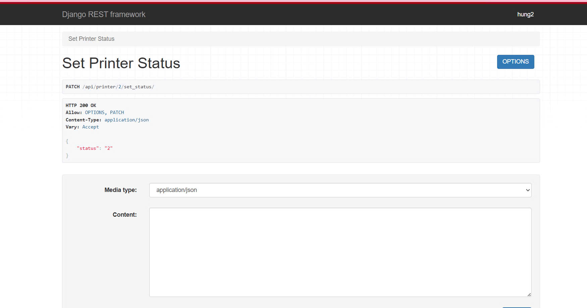

# Intro about *CNPM* :ghost:

#### In this situation, I will introduce you about changes I got:

    
    
- I create an ability for SPSO to set status of printer (@API_VIEW) and hide printer_id from URL. If you want to find my API, this is my link:

        https://docs.google.com/spreadsheets/d/1jCvhyteSWicAXYXb6aer0u6OcrsnQEqivEJ67c9ZJLo/edit?gid=1575679770#gid=1575679770

- I create email for forgot password (so wasting my time)

First => I register my account:

After that I click on forgot password:

After that I enter email:

My email has sent:

I click on the link to change password:

Finally, I complete the process:

    => I hope you enjoy it. If you consider about what I code. Do not hesitate to contact me!!

Because my security, I do not provide my email and password. So I erase it, you can enter it to test if you want. Thanks!!
:smile: 
