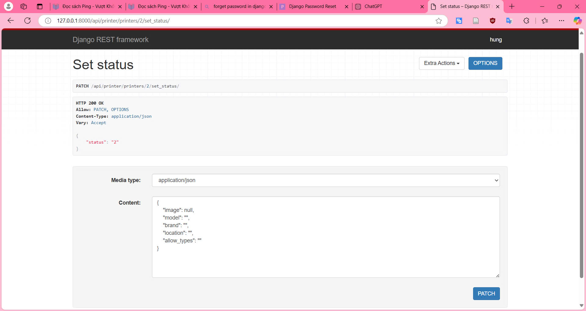
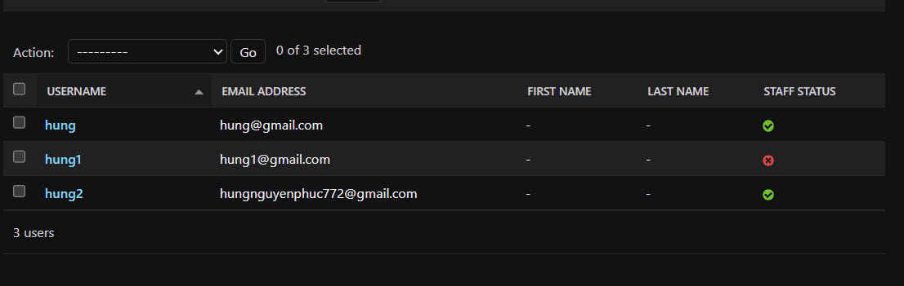
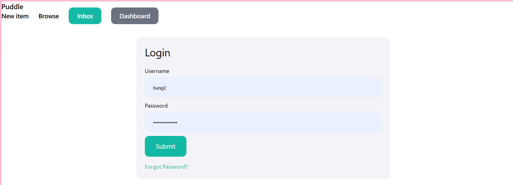
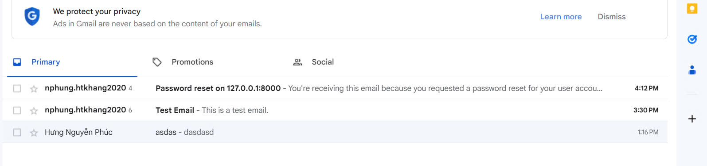
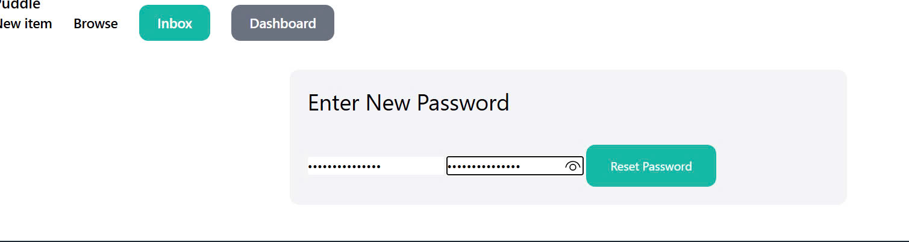

# Intro about *CNPM* :ghost:

#### In this situation, I will introduce you about changes I got:

    
    
- I create ability for SPSO to set status of printer

- I create email for forgot password (so waste my time)

First => I register my account:

After that I click on register:

After that I enter email:

My email has sent:

I click on the link to change password:

Finally, I complete the process:

    => I hope you enjoy it. If you consider about what I code. Do not hesitate to contact me!!

Because my security, I do not provide my email and password. So I erase it, you can enter it to test if you want. Thanks!!
:smile: 
