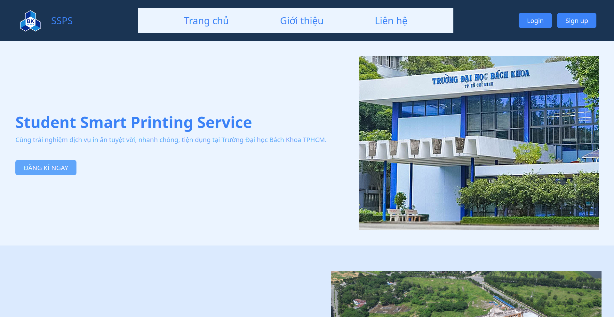

# CNPM_HCMUT_SPSS
Welcome to our HCMUT_SPSS.

Have a look at our app by [clicking here](https://spss-frontend-1.vercel.app/)

## Overview
HCMUT_SSPS is a smart printing service for HCMUT students to use the printing facilities in HCMUT more efficiently. The students can use this system to pre-order their printing needs without having to wait in a line in traditional method. The system also provides a feature of storing your printing information, such as the metadata of the document, amount, date, time, location... of each of your order. Students can then view all the details of their system usage in the history.

The system is managed by the Student Printing Service Officer (SPSO). They are responsible for configuring the system, managing the printers and viewing the statistics and performance of the HCMUT_SSPS. SPSO can also view users' printing history.

The service is now online and you can have a try on it.

## Technology Stack
- Front-end: ReactJS, Bootstrap, Tailwinds and other additional libraries provided by npm.
- Back-end: Django.
- Database: MySQL.

## Drawbacks
- Payment methods not integrated

## Using the app
[Click here](https://spss-frontend-1.vercel.app/) to redirect to the webpage

You can create an user account on your own or using the two below:

To log in as a student: (will take you to user site)
* Email: `nghia@hcmut.edu.vn`
* Password: `12345`

To log in as an admin: (you will be taken to a seperate panel for admin user)
* Username: `admin1@hcmut.edu.vn`
* Password: `12345`

You are now ready to explore our application!

## Contributors
This project is developed by a group of Computer Science students from Ho Chi Minh University of Technology (HCMUT). Our members of the team:
* 2212243 - Trương Quang Nghĩa
* 2213012 - Huỳnh Thanh Tâm
* 2213772 - Lê Đức Anh Tuấn
* 2212059 - Nguyễn Hồng Minh
* 2212432 - Lê Nguyễn Yến Nhi
* 2211368 - Nguyễn Phúc Hưng
* 2211363 - Lê Nguyễn Gia Hưng
* 2211806 - Dương Gia Lâm

